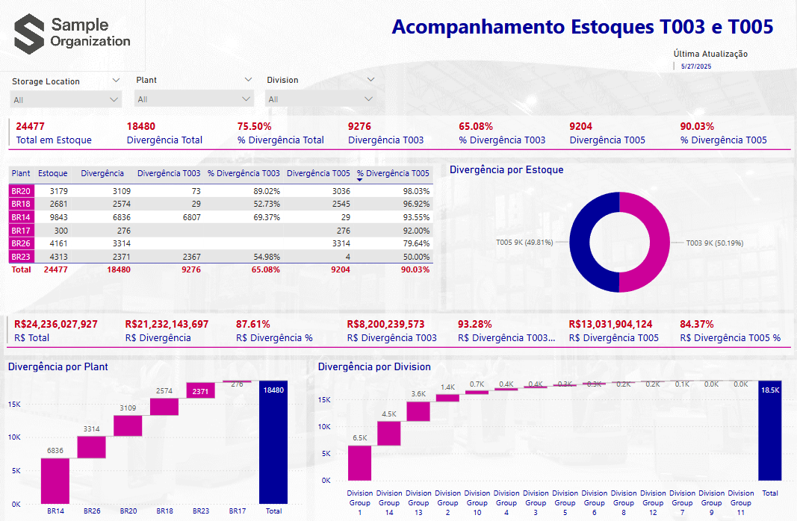

# Sample_Organization_3.Pbix

## Description.

This tool support warehouses in BR for Sample Organization to identify expired orproducts. Bellow you will find a list of pages and a description about it.

    1) Painel T. Expired products on stock by warehouse location.
    2) Análise Estoque. Expired Material by divisions.
    3) FUP. Details of expired Material by divisions.
    4) Resuno KPI. Summarize of KPI's values.
 
Thanks

