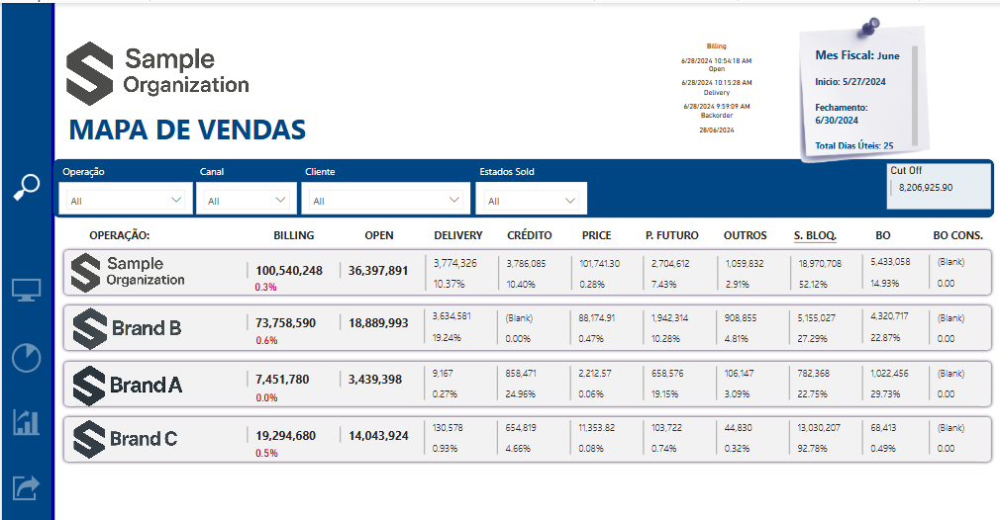

# Sample_Organization_2.Pbix

## Description.

This dashboard provides a insights in portuguese about financial KPi's  for 3 brands (Brand A, Brand B, Brand C) from different sources such billing reports, open orders and product os deliver. Bellow you will find a list of pages and a description about it.

    1) Franquia. Main page with KPI's such billing, open ordes and products on delivry.
    2) Quadro. Main KPI's by franchiche.
    3) Top Ofenders. Open order issues (Credit blocks, Price, BO) and orders ready to bill by customer.
    4) Analise. Table with details about oper order issues.
    5) Entrada de Pedidos. Criation of orders against billing.
    6) Acumulado Mes. Comulative creation of orders against billing.
    8) Report. Detailed report for download it.
    9) Recusas /Devoluções. Returns analysis.

Thanks

